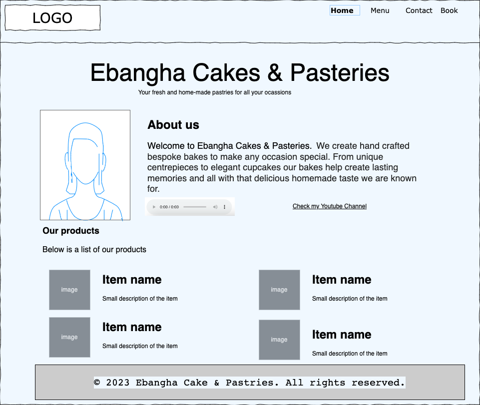

# Programming With Berns 
## Project Description for Web Development With HTML5

## Summary
Madam Ebangha is the CEO of Ebangha Cakes and Pastries. She has been using her WhatsApp status to advertise her business but she has noticed she has started getting orders from international clients. She thinks that having a website will enable her reach a wider audience and even grow her business. She has contacted you with the following specifications

## Website requirements

## Functional Requirements

###  Site Navigation  
The website should have four pages, home, menu, contact and book

### Home Page
The first page of the website
*   This shall contain a brief information about the business in both text and audio. 
    - The text is as shown in the home page sketch below. 
    - She has provided you with an .mp3 recording of her voice (see [audio description](audio/audio-description.mp3))
    - She also want that customers can connect to her youtube channel from the home page. The link to the youtube channel is https://www.youtube.com/@programmingwithberns 
*   It shall contain a section called About with a photo of herself and a brief description of herself. She has given you an image of [herself](images/ceo.jpg). Her image is at [`views/ceo.jpg`](images/ceo.jpg). 
*   It shall also contain images of the products that she sells with brief information about each product. See [products.json](products.json)
* It shall contain links to the other pages

Below is a sketch of the home page

The website logo is [logo.png](images/logo.png)

### Menu Page
* This page shall contain the menu of the different items offered each day.
* It shall contain links to the other pages

Below is a sketch of the menu page

   
### Contact Page
* This page shall contain their contact information, as well as google maps direction to her shop

* It shall contain links to the other pages

Below is a sketch of the contact page

    
### Booking Page 
* This page shall contain a form where users customers can order the items that she is selling

* It shall contain links to the other pages

Below is a sketch of the booking page

## Non functional requirements

Madam Ebangha has taste for colors and would love to have the following

1.  The background color of the page should be light blue. Use "#f0f8ff"
2.  The bottom of the page (footer) should contain the text
    <pre>
    © 2023 Ebangha Cake & Pastries. All rights reserved.
    </pre>
    
    This bottom section should be light grey (use "#d3d3d3")

### Evaluation criteria
1. Your code pass the [W3 HTML5 validator standard](https://validator.w3.org/).
2. Your user website looks like the sketch that has been provided for you. 
3. Your website can be accessed publicly from GitHub or any other hosting provider.

- Extra. 
Complete these if you want to be get excellence 
    - Your website should have a favicon. Read more about favicons [here](https://careerkarma.com/blog/html-favicon/).
    The favicon for this project has been provided for you as [favicon_io.zip](favicon_io.zip).
    - Your website should have should have atleast two extra meta tags apart from `<meta charset="UTF-8">`. You can read more about HTML meta tags [here](https://www.searchenginewatch.com/2018/04/04/a-quick-and-easy-guide-to-meta-tags-in-seo/)